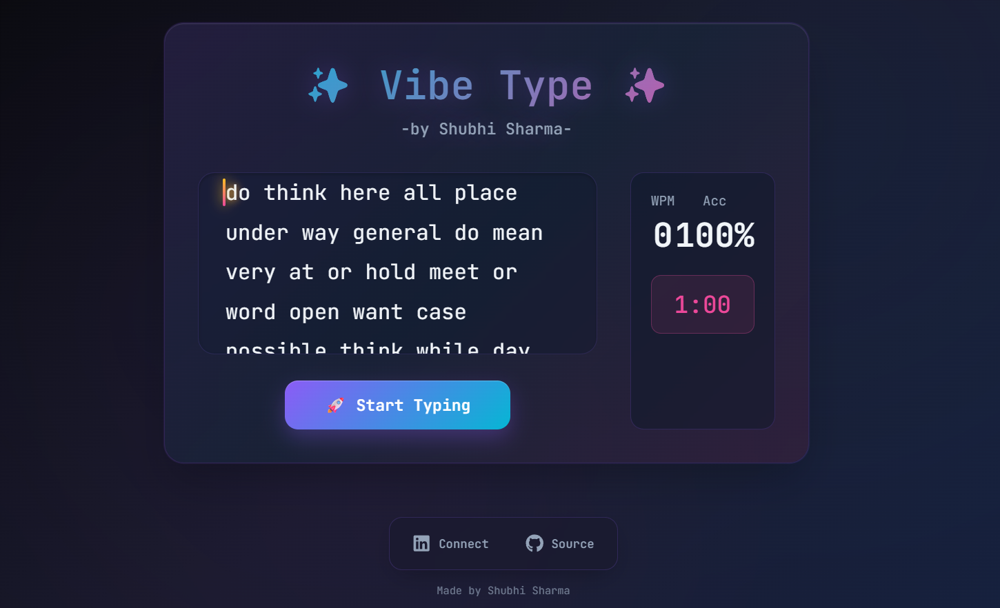

# ✨ Vibe Type


Vibe Type is a minimalist, visually-appealing typing test application built to provide a clean and calm typing experience. This project marks **Day 1** of my **#30DaysOfVibeCoding** challenge.

---

### 🌐 **[Live Demo](https://demo.vercel.app)**

---



---

## 🚀 About This Project


**Vibe Type** is the first project in this series. It was developed using a "Vibe Coding" approach, where AI tools act as creative collaborators rather than just utilities. By leveraging AI for brainstorming, code snippets, and debugging, I was able to stay in a state of creative flow, focusing on the design, user experience, and the features that make the project feel exciting.

## 🎨 Features

- **Real-time WPM and Accuracy:** Track your typing speed and accuracy as you go.
- **Minimalist & "Vibe" Aesthetic:** A clean, dark-themed UI with subtle gradients and animations to create a calm, focused environment.
- **Component-Based Architecture:** Built with React and broken down into reusable components for maintainability.
- **Responsive Design:** A seamless experience on both desktop and mobile devices.
- **Interactive Results Screen:** Get a summary of your performance after the timer ends.
- **Chill Background Music:** An optional audio track to help you get in the zone.
- **Polished Sticky Footer:** A visually appealing footer with social links.

## 🛠️ Tech Stack

- **Framework:** [React](https://reactjs.org/)
- **Build Tool:** [Vite](https://vitejs.dev/)
- **Styling:** CSS3 with a mobile-first approach
- **Icons:** [React Icons](https://react-icons.github.io/react-icons/)
- **Deployment:** [Vercel](https://vercel.com/)

---

## ⚙️ Getting Started

To get a local copy up and running, follow these simple steps.

### Prerequisites

You need to have [Node.js](https://nodejs.org/) and [npm](https://www.npmjs.com/) installed on your machine.

### Installation & Setup

1.  **Fork the repository** by clicking the 'Fork' button on the top right of this page.

2.  **Clone your forked repository:**
    ```sh
    git clone https://github.com/shvbhii/Vibe-Typing.git
    ```

3.  **Navigate to the project directory:**
    ```sh
    cd Vibe-Typing
    ```

4.  **Install NPM packages:**
    ```sh
    npm install
    ```

5.  **Run the development server:**
    ```sh
    npm run dev
    ```
    The app will be available at `http://localhost:5173/` (or the next available port).

---

## 🤝 Contributing

Contributions are what make the open-source community such an amazing place to learn, inspire, and create. Any contributions you make are **greatly appreciated**.

### Reporting Issues

If you find a bug or have a suggestion for improvement, please open an issue on the [Issues](https://github.com/shvbhii/vibe-type/issues) page of this repository.

### Pull Requests

1.  Fork the Project.
2.  Create your Feature Branch (`git checkout -b feature/AmazingFeature`).
3.  Commit your Changes (`git commit -m 'Add some AmazingFeature'`).
4.  Push to the Branch (`git push origin feature/AmazingFeature`).
5.  Open a Pull Request.

---

## 📬 Connect with Me

Created with a vibe by **Shubhi Sharma**.

[](https://www.linkedin.com/in/shvbhi)

Feel free to connect with me on LinkedIn. I'd love to hear your thoughts, feedback, or just say hi!

---

## 📜 License

This project is licensed under the MIT License. See the `LICENSE` file for more details.